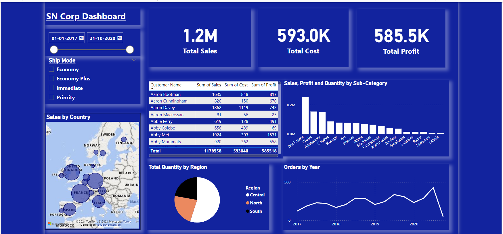

# SN Corp Store Dashboard Using Power BI

## Project Overview

This project presents an interactive dashboard developed using Power BI for SN Corp, focusing on various key performance indicators (KPIs) to monitor business metrics. The dashboard leverages advanced data analysis techniques, including DAX formulas and dynamic charts, to provide actionable insights into the store's performance.

## Key Objectives

1. Sales Performance Monitoring: Track and analyze sales trends over different time periods.
2. Customer Insights: Understand customer behavior through segmentation and purchasing patterns.
3. Product Analysis: Evaluate the performance of various products and identify top-selling items.
4. Store Efficiency: Monitor key operational metrics such as inventory levels and turnover rates.
5. Financial Overview: Present a clear view of the store’s financial health through revenue and profit analysis.

## Data Source

The dataset used for this dashboard includes transactional data, product details, and customer demographics. The dataset consists of over 4,100 rows, providing a robust foundation for in-depth analysis.

## Analysis Techniques

- KPIs: Utilized to provide a quick snapshot of key metrics such as total sales, average order value, and customer satisfaction.
- DAX (Data Analysis Expressions): Employed to create complex calculated fields, enabling dynamic analysis and in-depth data exploration.
- Charts and Visualizations: Created a variety of charts including bar charts, line graphs, and pie charts to represent data visually, making it easier to identify trends and patterns.
- Interactive Elements: Included slicers and filters for dynamic data exploration, allowing users to customize their views and focus on specific areas of interest.

## Results and Insights

- Top-Performing Products: Identified the top 10 products contributing to the majority of sales, aiding in inventory and promotional planning.
- Customer Segmentation: Discovered that a specific customer segment accounts for the highest revenue, indicating a potential target group for marketing efforts.
- Sales Trends: Observed consistent sales growth during festive seasons, providing insights for future campaign planning.

## Conclusion

The SN Corp Store Dashboard offers a comprehensive analysis of the store’s operations, providing valuable insights that can drive strategic decision-making. The interactive nature of the dashboard allows users to explore the data from multiple angles, ensuring a thorough understanding of business performance.

## How to Use

1. Open the Power BI file (`SNCorpDashboard.pbix`) in Power BI Desktop.
2. Explore the different tabs and visualizations to understand the insights.
3. Use the interactive slicers and filters to customize the dashboard view according to your specific requirements.

## Contact Information

For any questions or further information, please contact:

- Name: Jyoti Sharma
- Email: jyotisharma112698@gmail.com
